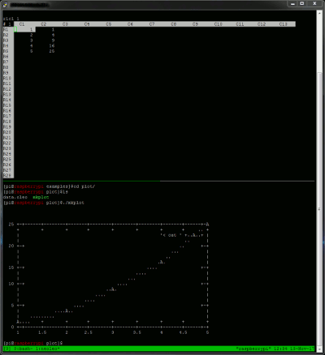

# Neoleo

Lightweight curses spreadsheet based on GNU oleo.

If you are downloading the file from github, most people, especially
distro packagers wanting to do typical configure && make && make install
should download the file neoleo-X.Y.Z.tar.gz, rather than the
source files.

## Quick start

Here, `C-` means the `Control character`, `M-` is the mod key, which is
either `Alt` or `ESC`.

| Key   | Purpose                              |
| ----- | ------------------------------------ |
| C-c   | copy cell formula to clipboard       |
| C-g   | cancels current operation            |
| C-l	| set cell alignment left              |
| M-m   | menu                                 |
| C-q   | quit                                 |
| C-r   | set cell alignment right             |
| C-s   | save document                        |
| C-v   | paste cell formula from clipboard    |

Other highly useful commands:

| Key   | Purpose                              |
| ----- | ------------------------------------ |
| C-o   | insert row above                     |
| C-k   | delete row                           |
| M-k   | delete column                        |
| M-o   | insert column to the left            |


## Documents and examples

Documentation is available [online](https://blippy.github.io/neoleo/).
Neoleo installs examples in a shared directory, typically
`/usr/local/share/neoleo`. The exact directory is determined by:
```
	neoleo --version | grep Datadir
```

You should explore that directory to see what is available.

## Features

* Ncurses interface
* Macro language
* Sizeable library of expressions (but not statistical regressions)
* Primitive file format conversions


## Compiling/installing

Read INSTALL, which contains general instructions, plus specific 
instructions like compiling from git, as well as trouble-shooting. 
Platform-specific comments are contained in INSTALL-${platform} 
files. INSTALL-debian covers Debian-derived distros like Ubuntu
and Mint.


## Screenshots



<br>A plot created using gnuplot, output to a dumb terminal (in
examples/plot)

## Getting fancy

`Neoleo` comes with a "headerless" mode, where you can interact
via stdin/stdout, a la `ed`. One command that `neoleo` has is
`tbl`, for example, which prints a sheet in `groff`-compatible form. So you
can create your spreadsheet, and create a nice PDF with it, say
by typing the following from the command line:
```
neoleo foo.oleo -H &lt;&lt;&lt;tbl 2&gt;dev/nu;; | groff -t -Tascii | text2pdf &gt;foo.pdf
```

## Technical Reports

Technical Reports, which is mostly of interest to developers, but
may have some bearing on users, so they may be advised to read them.


## Links

*  bug-oleo archives: http://lists.gnu.org/archive/html/bug-oleo/
*  html documentation: https://blippy.github.io/neoleo/
*  Freshcode announcement: http://freshcode.club/projects/neoleo
*  papoanaya has a version of oleo on github: https://github.com/papoanaya/oleo
